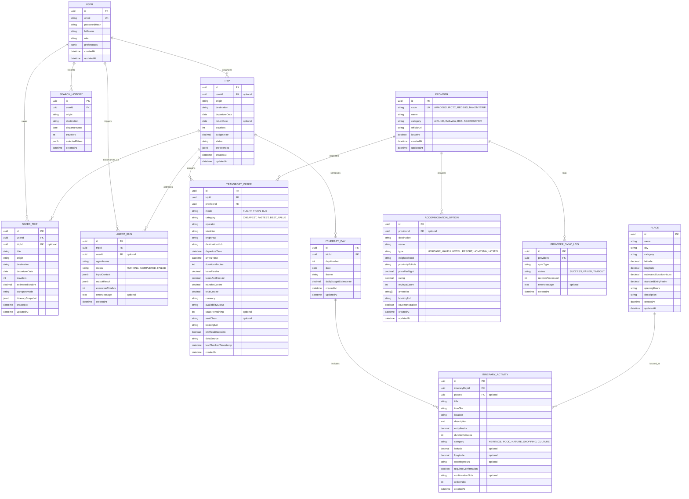

# Safar Saarthi — Entity-Relationship (ER) Diagram

The following Mermaid ER Diagram models the PostgreSQL relational schema implemented via Prisma ORM for Safar Saarthi.

```mermaid
erDiagram
    USER ||--o{ TRIP : "organizes"
    USER ||--o{ SAVED_TRIP : "saves"
    USER ||--o{ SEARCH_HISTORY : "records"
    USER ||--o{ AGENT_RUN : "triggers"

    TRIP ||--o{ TRANSPORT_OFFER : "contains"
    TRIP ||--o{ ITINERARY_DAY : "schedules"
    TRIP ||--o{ SAVED_TRIP : "bookmarked_as"
    TRIP ||--o{ AGENT_RUN : "optimizes"

    PROVIDER ||--o{ TRANSPORT_OFFER : "originates"
    PROVIDER ||--o{ ACCOMMODATION_OPTION : "provides"
    PROVIDER ||--o{ PROVIDER_SYNC_LOG : "logs"

    ITINERARY_DAY ||--o{ ITINERARY_ACTIVITY : "includes"
    PLACE ||--o{ ITINERARY_ACTIVITY : "located_at"

    USER {
        uuid id PK
        string email UK
        string passwordHash
        string fullName
        string role
        jsonb preferences
        datetime createdAt
        datetime updatedAt
    }

    TRIP {
        uuid id PK
        uuid userId FK "optional"
        string origin
        string destination
        date departureDate
        date returnDate "optional"
        int travelers
        decimal budgetInInr
        string status
        jsonb preferences
        datetime createdAt
        datetime updatedAt
    }

    TRANSPORT_OFFER {
        uuid id PK
        uuid tripId FK
        uuid providerId FK
        string mode "FLIGHT, TRAIN, BUS"
        string category "CHEAPEST, FASTEST, BEST_VALUE"
        string operator
        string identifier
        string originHub
        string destinationHub
        datetime departureTime
        datetime arrivalTime
        int durationMinutes
        decimal baseFareInr
        decimal taxesAndFeesInr
        decimal transferCostInr
        decimal totalCostInr
        string currency
        string availabilityStatus
        int seatsRemaining "optional"
        string seatClass "optional"
        string bookingUrl
        boolean isOfficialDeepLink
        string dataSource
        datetime lastCheckedTimestamp
        datetime createdAt
    }

    PROVIDER {
        uuid id PK
        string code UK "AMADEUS, IRCTC, REDBUS, MAKEMYTRIP"
        string name
        string category "AIRLINE, RAILWAY, BUS, AGGREGATOR"
        string officialUrl
        boolean isActive
        datetime createdAt
        datetime updatedAt
    }

    ITINERARY_DAY {
        uuid id PK
        uuid tripId FK
        int dayNumber
        date date
        string theme
        decimal dailyBudgetEstimateInr
        datetime createdAt
        datetime updatedAt
    }

    ITINERARY_ACTIVITY {
        uuid id PK
        uuid itineraryDayId FK
        uuid placeId FK "optional"
        string title
        string timeSlot
        string location
        text description
        decimal entryFeeInr
        int durationMinutes
        string category "HERITAGE, FOOD, NATURE, SHOPPING, CULTURE"
        decimal latitude "optional"
        decimal longitude "optional"
        string openingHours "optional"
        boolean requiresConfirmation
        string confirmationNote "optional"
        int orderIndex
        datetime createdAt
    }

    ACCOMMODATION_OPTION {
        uuid id PK
        uuid providerId FK "optional"
        string destination
        string name
        string type "HERITAGE_HAVELI, HOTEL, RESORT, HOMESTAY, HOSTEL"
        string neighborhood
        string proximityToHub
        decimal pricePerNight
        decimal rating
        int reviewsCount
        string[] amenities
        string bookingUrl
        boolean isDemonstration
        datetime createdAt
        datetime updatedAt
    }

    PLACE {
        uuid id PK
        string name
        string city
        string category
        decimal latitude
        decimal longitude
        decimal estimatedDurationHours
        decimal standardEntryFeeInr
        string openingHours
        string description
        datetime createdAt
        datetime updatedAt
    }

    SAVED_TRIP {
        uuid id PK
        uuid userId FK
        uuid tripId FK "optional"
        string title
        string origin
        string destination
        date departureDate
        int travelers
        decimal estimatedTotalInr
        string transportMode
        jsonb itinerarySnapshot
        datetime createdAt
        datetime updatedAt
    }

    SEARCH_HISTORY {
        uuid id PK
        uuid userId FK
        string origin
        string destination
        date departureDate
        int travelers
        jsonb selectedFilters
        datetime createdAt
    }

    AGENT_RUN {
        uuid id PK
        uuid tripId FK
        uuid userId FK "optional"
        string agentName
        string status "RUNNING, COMPLETED, FAILED"
        jsonb inputContext
        jsonb outputResult
        int executionTimeMs
        text errorMessage "optional"
        datetime createdAt
    }

    PROVIDER_SYNC_LOG {
        uuid id PK
        uuid providerId FK
        string syncType
        string status "SUCCESS, FAILED, TIMEOUT"
        int recordsProcessed
        text errorMessage "optional"
        datetime createdAt
    }
```
