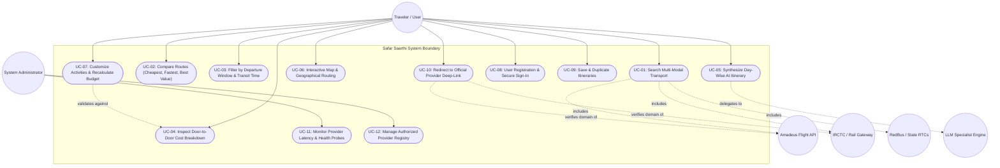

# Safar Saarthi — Use-Case Diagram

The following diagram defines the system boundaries, human actors, external provider actors, and core functional use cases across Safar Saarthi.

```mermaid
flowchart TD
    Traveler(("Traveler / User"))
    Admin(("System Administrator"))
    AmadeusAPI(("Amadeus Flight API"))
    IRCTCAPI(("IRCTC / Rail Gateway"))
    RedBusAPI(("RedBus / State RTCs"))
    LLMService(("LLM Specialist Engine"))

    subgraph "Safar Saarthi System Boundary"
        UC1(["UC-01: Search Multi-Modal Transport"])
        UC2(["UC-02: Compare Routes (Cheapest, Fastest, Best Value)"])
        UC3(["UC-03: Filter by Departure Window & Transit Time"])
        UC4(["UC-04: Inspect Door-to-Door Cost Breakdown"])
        UC5(["UC-05: Synthesize Day-Wise AI Itinerary"])
        UC6(["UC-06: Interactive Map & Geographical Routing"])
        UC7(["UC-07: Customize Activities & Recalculate Budget"])
        UC8(["UC-08: User Registration & Secure Sign-In"])
        UC9(["UC-09: Save & Duplicate Itineraries"])
        UC10(["UC-10: Redirect to Official Provider Deep-Link"])
        UC11(["UC-11: Monitor Provider Latency & Health Probes"])
        UC12(["UC-12: Manage Authorized Provider Registry"])
    end

    Traveler --> UC1
    Traveler --> UC2
    Traveler --> UC3
    Traveler --> UC4
    Traveler --> UC5
    Traveler --> UC6
    Traveler --> UC7
    Traveler --> UC8
    Traveler --> UC9
    Traveler --> UC10

    Admin --> UC11
    Admin --> UC12

    UC1 -.->|includes| AmadeusAPI
    UC1 -.->|includes| IRCTCAPI
    UC1 -.->|includes| RedBusAPI

    UC5 -.->|delegates to| LLMService
    UC7 -.->|validates against| UC4
    UC10 -.->|verifies domain of| IRCTCAPI
    UC10 -.->|verifies domain of| AmadeusAPI
```
